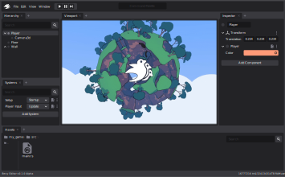

# `bevy_editor_mockup`

This is a mockup I made of an editor for the [Bevy](https://bevyengine.org/) game engine!

It's dual-licensed under the [MIT](LICENSE-MIT) and [Apache 2.0](LICENSE-APACHE) licenses so it could be used in Bevy itself.

## License

`SPDX-License-Identifier: Apache-2.0 OR MIT`
